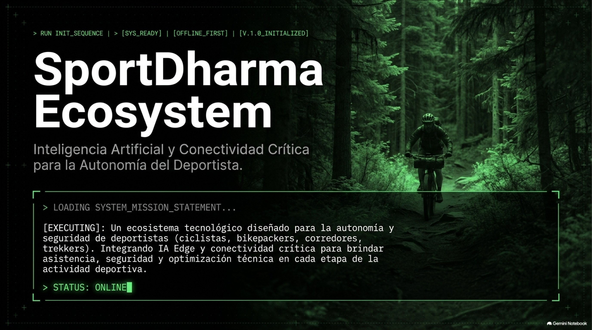
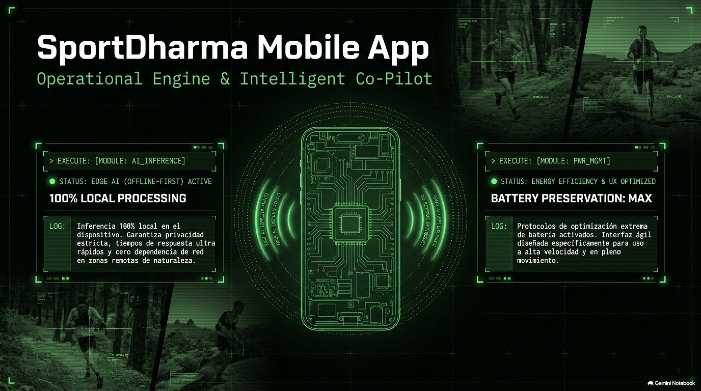
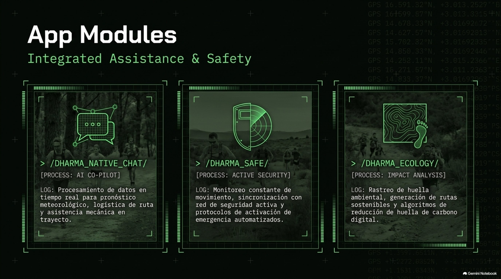
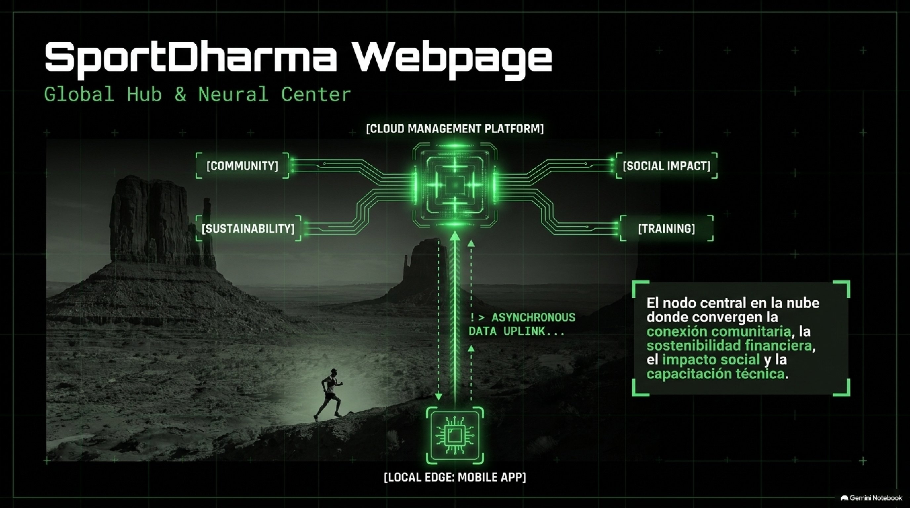
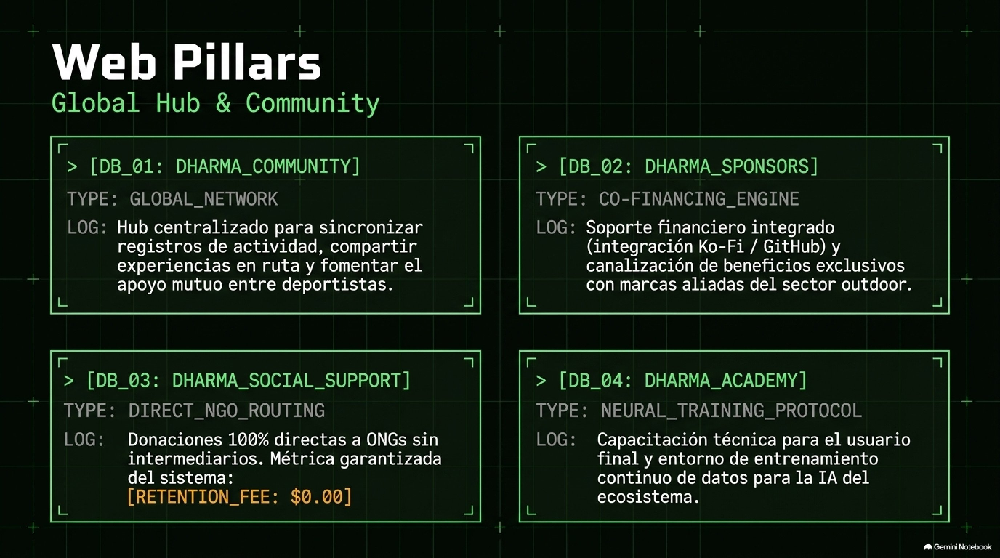

# SportDharma Ecosystem | IA | Conectividad

> **Infraestructura de misión crítica que garantiza autonomía absoluta y seguridad en zonas remotas.**

---

### Resumen de la secuencia

* **Módulo 01 - Núcleo del Sistema:** Procesamiento 100% local para privacidad, velocidad y cero dependencia de la red.
* **Módulo 02 - Asistencia Inteligente:** Módulos impulsados por IA para seguridad en senderos, logística e impacto ambiental.
* **Módulo 03 - Arquitectura:** Sincronización fluida entre el entorno móvil local (*Local Edge*) y el centro global (*Global Hub*).
* **Módulo 04 - El Hub Web:** Centro neuronal con cofinanciamiento y protocolos filantrópicos directos.
* **Módulo 05 - Compromiso Cero:** Modelo transparente con 0% de tarifas de retención para ayuda social.

---

### Secuencia visual de diapositivas

